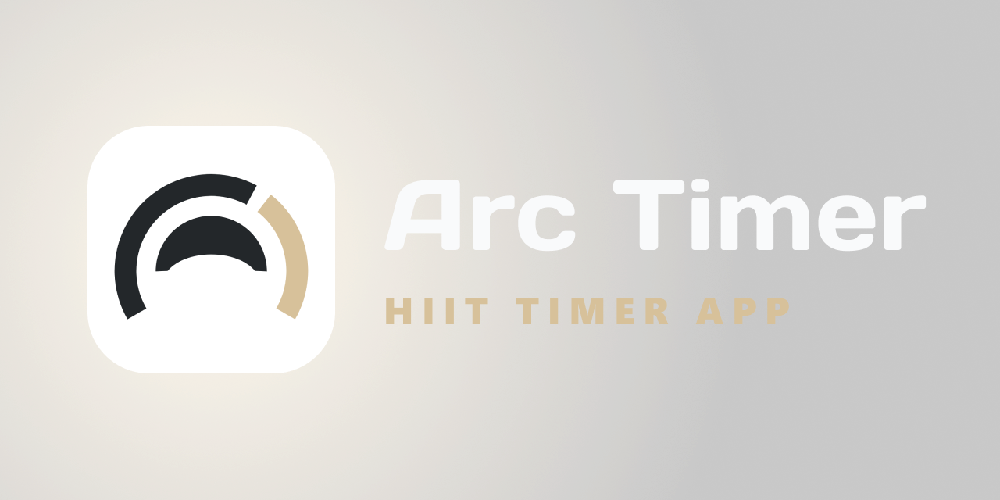

# ARC Timer

<p align="center">
  
</p>

<p align="center">
  
  
  
  
  
  
</p>

ARC Timer is a React Native HIIT workout application built with Expo and Expo Router. It covers the full workout lifecycle on-device: structured workout definition, guided timer execution, session tracking, persisted preferences, and workout transfer through a custom `.arcw` file format.

## Contents

- [Features](#features)
- [Tech Stack](#tech-stack)
- [Implementation Details](#implementation-details)
- [Technical Decisions](#technical-decisions)
- [Run Locally](#run-locally)
- [Project Structure](#project-structure)
- [License](#license)

## Features

- Create and edit workouts composed of blocks, sets, exercises, and rest periods
- Start a quick workout flow without saving a workout first
- Run workouts through a dedicated timer flow with audio cues and animated feedback
- Persist workouts, settings, and session history locally with Zustand and AsyncStorage
- Mark workouts as favorites
- Import and export workouts via `.arcw` files
- Support English and Portuguese (`pt-PT`)
- Switch theme, accent color, and sound preferences

## Tech Stack

- **Application framework:** Expo, React Native, React 19
- **Navigation:** Expo Router
- **Language:** TypeScript
- **State management:** Zustand
- **Persistence:** AsyncStorage
- **Localization:** i18next, react-i18next
- **Animation:** React Native Reanimated

## Implementation Details

- **Structured workout model**  
  Blocks, sets, exercises, and rest phases are modeled explicitly and reused across editing, execution, and import/export.

- **Planned timer execution**  
  Workout runs are converted into explicit execution steps before playback, keeping progression and phase transitions predictable.

- **Local-first persistence**  
  Workouts, ordering, favorites, settings, and session history are stored on-device with Zustand and AsyncStorage.

- **Isolated draft flow**  
  Draft editing is kept separate from persisted workout data to isolate creation and edit flows from saved state.

- **Versioned `.arcw` format**  
  Import and export use a validated, versioned file contract for workout sharing.

- **Structured localization**  
  English and Portuguese (`pt-PT`) are integrated through a dedicated i18n setup.

- **Separated animation layer**  
  Animation concerns are handled independently from timer execution logic to keep runtime behavior stable.

## Technical Decisions

- **Expo Router for route structure**
  - File-based routing keeps screen organization explicit and easy to inspect in a multi-flow mobile app.

- **Zustand for focused client-side state**
  - Zustand keeps state logic direct while supporting persisted stores and isolated editing flows.

- **AsyncStorage for persistence**
  - AsyncStorage meets the app's local-first requirements without adding storage complexity.

- **Separate timer planning and timer engine layers**
  - The run planner converts workouts into execution steps, while the timer engine handles progression and timing behavior.
  - This separation keeps workout modeling concerns distinct from runtime countdown mechanics.

- **Versioned `.arcw` import/export contract**
    - The custom workout file format makes serialization explicit and leaves room for format evolution without relying on ad hoc JSON sharing.

- **Domain logic outside screen components**
    - Core timer, workout, validation, and serialization logic live outside screen implementations, keeping UI components focused on presentation and interaction.

## Run Locally

```bash
npm install
npm run start
```

Useful platform commands:

```bash
npm run ios
npm run android
npm run web
```

## Project Structure

```text
app/                  Expo Router routes
src/components/       Shared UI and reusable building blocks
src/screens/          Screen-level implementations
src/core/             Timer logic, entities, import/export, domain helpers
src/state/            Zustand stores
src/theme/            Theme, palette, typography, style helpers
src/i18n/             Localization setup and translations
assets/               Icons, splash assets, sounds, readme media
scripts/              Local utility and asset generation scripts
```

## License

This project is licensed under the MIT License.
